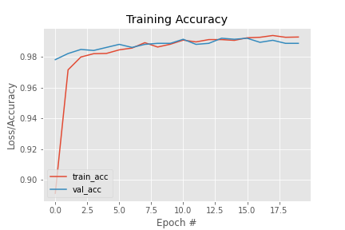
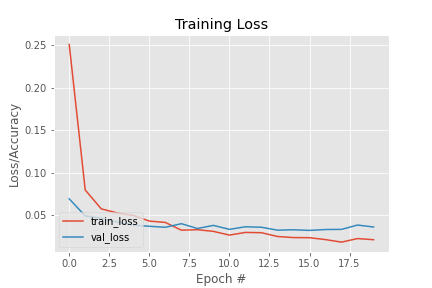
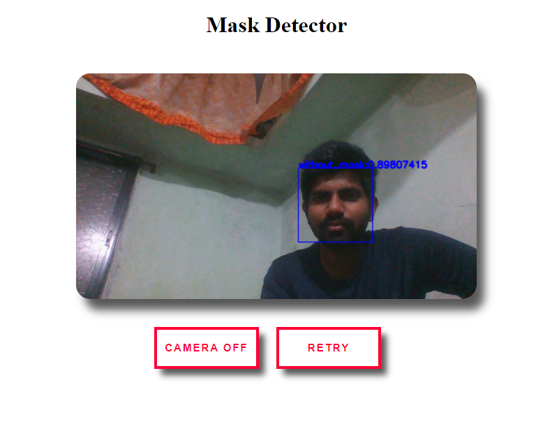
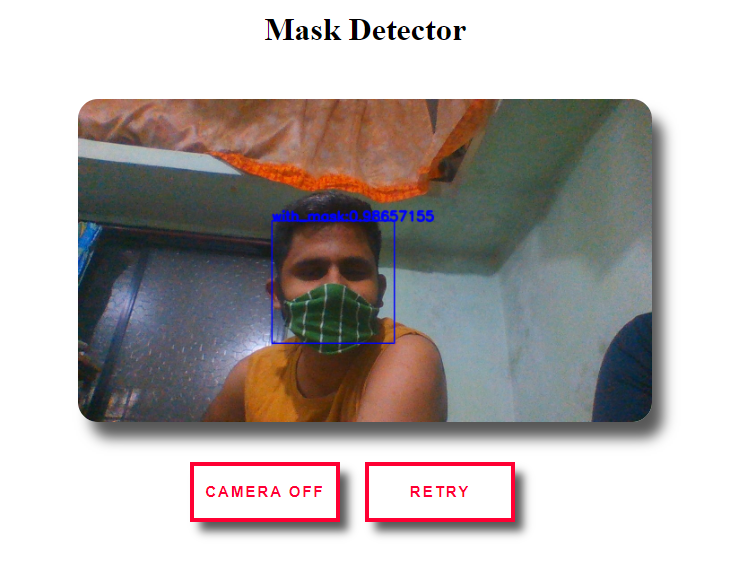
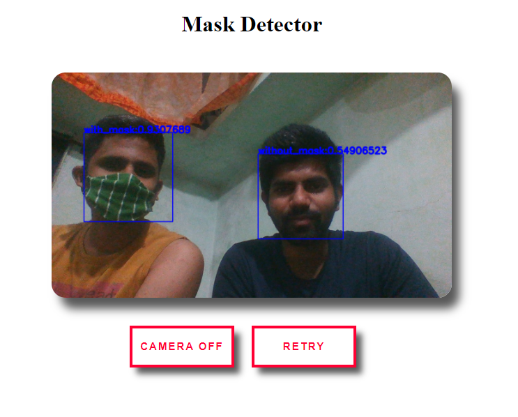

# FaceMaskDetection-TF2-Flask

Hi!, welcome to our repository. This is a fun project developed to get better insights on **Computer Vision** and **Image Classification**. We developed **MobileNetV2** based model to identify if a person is wearing a mask or not. It is a simple web application developed with the help of Flask. The model is **binary classification type** model with classes respectively as **With Mask** or **Without Mask**. The dataset that we used for training the model can be found [here](https://www.kaggle.com/omkargurav/face-mask-dataset?select=data)

# Getting Started

These instructions will get you a copy of the project up and running on your local machine for development and testing purposes.

## Prerequisites
Before initializing with this project you must know the following concepts: 

 - Machine Learning - `Classification`
 - Deep Learning - `Neural Networks`, `CNN Networks`, `TensorFlow(TF2)`
 - Transfer Learning
 - Computer Vision - `OpenCV Library`
 - Web Application Development - `Flask`, `Jinja Templates`
 
## Setting up the environment

1.  Clone the repository  `git clone https://github.com/Purnay087/FaceMaskDetection-TF2-Flask.git`.

2.  Install requirements using  `pip install -r requirements.txt`

## To train model with custom dataset
If you want a custom dataset for your model follow these steps:-
1. Download your dataset
2. Categorize your dataset in two folders named **with_mask** and **without_mask**
3.  Put these two folders inside dataset folder inside project's home directory
4. [Use this file](train-mask-detector.ipynb) to train your model

## Executing the project

  > Execute main.py file to start the web application

## Accuracy-Loss graphs

***

## Screenshots

***

***

